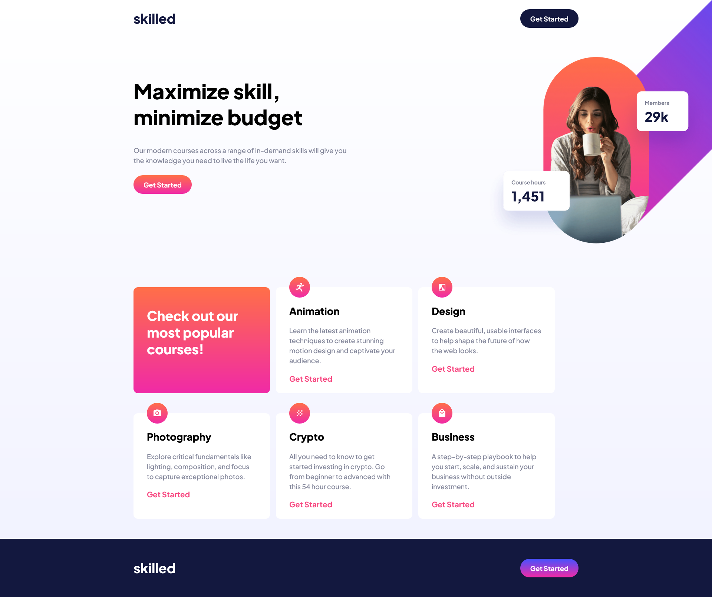

# Frontend Mentor - Skilled e-learning landing page solution

This is a solution to the [Skilled e-learning landing page challenge on Frontend Mentor](https://www.frontendmentor.io/challenges/skilled-elearning-landing-page-S1ObDrZ8q). Frontend Mentor challenges help you improve your coding skills by building realistic projects.

## Table of contents

- [Frontend Mentor - Skilled e-learning landing page solution](#frontend-mentor---skilled-e-learning-landing-page-solution)
  - [Table of contents](#table-of-contents)
  - [Overview](#overview)
    - [The challenge](#the-challenge)
    - [Screenshot](#screenshot)
    - [Links](#links)
  - [My process](#my-process)
    - [Built with](#built-with)
    - [Continued development](#continued-development)
    - [Useful resources](#useful-resources)
  - [Author](#author)

## Overview

### The challenge

Users should be able to:

- View the optimal layout depending on their device's screen size
- See hover states for interactive elements

### Screenshot

### Links

- Solution URL: 
- Live Site URL: https://skilled-elearning-landing-page-rust.vercel.app/

## My process

### Built with

- Semantic HTML5 markup
- Flexbox
- Mobile-first workflow

### Continued development
This project pushed me to go a little more advanced in my use of Flexbox.

### Useful resources

- [WesBos's Flexbox course](https://flexbox.io/) - I followed this course to fill to fill my knowledge gaps in Flexbox for this project.
  
## Author

- Frontend Mentor - [@andrew2764](https://www.frontendmentor.io/profile/andrew2764)
